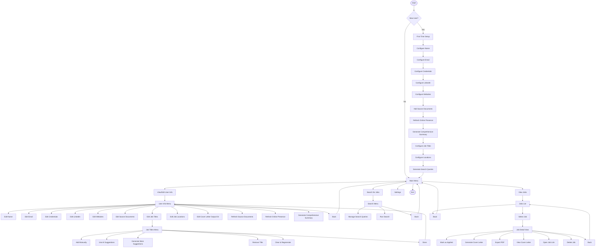

# JobSearch  

```
   $$$$$\           $$\        $$$$$$\                                          $$\
   \__$$ |          $$ |      $$  __$$\                                         $$ |
      $$ | $$$$$$\  $$$$$$$\  $$ /  \__| $$$$$$\   $$$$$$\   $$$$$$\   $$$$$$$\ $$$$$$$\
      $$ |$$  __$$\ $$  __$$\ \$$$$$$\  $$  __$$\  \____$$\ $$  __$$\ $$  _____|$$  __$$\
$$\   $$ |$$ /  $$ |$$ |  $$ | \____$$\ $$$$$$$$ | $$$$$$$ |$$ |  \__|$$ /      $$ |  $$ |
$$ |  $$ |$$ |  $$ |$$ |  $$ |$$\   $$ |$$   ____|$$  __$$ |$$ |      $$ |      $$ |  $$ |
\$$$$$$  |\$$$$$$  |$$$$$$$  |\$$$$$$  |\$$$$$$$\ \$$$$$$$ |$$ |      \$$$$$$$\ $$ |  $$ |
 \______/  \______/ \_______/  \______/  \_______| \_______|\__|       \_______|\__|  \__|
```

An AI-powered CLI tool for automating your job search. Upload your CV, configure your preferences, and let Claude or OpenAI find relevant positions, filter them for suitability, and generate tailored cover letters.

## Features

- **Smart Job Search**: Uses Claude AI with web search to find job postings matching your criteria
- **AI-Powered Filtering**: Automatically filters out unsuitable jobs based on your background
- **Comprehensive Profile**: Build a profile from CVs, resumes, LinkedIn, GitHub, and personal websites
- **Cover Letter Generation**: Generate tailored cover letters as professional PDFs using LaTeX
- **AI Suggestions**: Get AI-generated suggestions for job titles and locations based on your background
- **Multi-User Support**: Run with different user profiles via command line arguments
- **Beautiful CLI**: Clean, colorful terminal interface with clear navigation

## Installation

### Prerequisites

- Python 3.10+
- [Claude CLI](https://docs.anthropic.com/claude-cli) installed and configured
- LaTeX distribution (for PDF cover letters) - `pdflatex` must be available in PATH
  - macOS: `brew install --cask mactex`
  - Ubuntu/Debian: `sudo apt-get install texlive-latex-base`
  - Windows: Install [MiKTeX](https://miktex.org/)

### Platform Support

| Platform | Clipboard | File Opening | Notes |
|----------|-----------|--------------|-------|
| macOS | ✓ Full (text + PDF) | ✓ | No additional setup |
| Windows | ✓ Text only | ✓ | PDF copies file path |
| Linux | ✓ Text only | ✓ | Requires `xclip` or `xsel` |

**Linux clipboard setup:**
```bash
sudo apt install xclip    # Debian/Ubuntu
sudo dnf install xclip    # Fedora
sudo pacman -S xclip      # Arch
```

### Setup

1. Clone the repository:
```bash
git clone https://github.com/yourusername/JobSearch.git
cd JobSearch
```

2. Run the application (automatically sets up virtual environment):
```bash
./run.sh
```

Or set up manually:
```bash
python3 -m venv .venv
source .venv/bin/activate
pip install -r requirements.txt
cd src && python3 main.py
```

### Optional: Shell Alias

Add to your `~/.zshrc` or `~/.bashrc`:
```bash
alias jobsearch="$HOME/path/to/JobSearch/run.sh"
```

Then run from anywhere:
```bash
jobsearch
```

## Usage

### Quick Start

1. Run `jobsearch` (or `./run.sh`)
2. Complete the first-time setup wizard
3. Add your CV/resume files
4. Configure desired job titles and locations
5. Generate search queries
6. Run the job search
7. Review found jobs and generate cover letters

### Multi-User Mode

Run with a specific user profile:
```bash
jobsearch -u username
```

User data is stored in `~/.JobSearch/<user_id>/`

## CLI Menu Flow



## Project Structure

```
JobSearch/
├── run.sh                    # Entry point script (sets up venv, runs app)
├── requirements.txt          # Python dependencies
├── README.md
└── src/
    ├── main.py               # CLI entry point, argument parsing
    ├── cli_menus.py          # CLI menu UI (UserOptions, JobOptions)
    ├── cli_utils.py          # Terminal formatting, colors, display helpers
    ├── utils.py              # Core utilities (Claude API, document parsing)
    ├── search_jobs.py        # Job search logic using Claude + web search
    ├── cover_letter_writer.py # Cover letter generation + LaTeX PDF export
    ├── online_presence.py    # LinkedIn, GitHub, website scraping
    ├── question_answerer.py  # Application question answering
    ├── prompts.py            # AI prompt templates and guidelines
    ├── services/             # Business logic layer (UI-agnostic)
    │   ├── __init__.py
    │   ├── progress.py       # Progress callback protocol
    │   ├── cover_letter_service.py  # Cover letter generation service
    │   └── user_profile_service.py  # User profile management service
    └── data_handlers/        # Data persistence layer
        ├── __init__.py
        ├── database.py       # SQLite database operations
        ├── users.py          # User profile management
        ├── jobs.py           # Job storage and management
        ├── queries.py        # Search query management
        └── utils.py          # Data utilities (datetime, etc.)
```

### Architecture

The codebase follows a layered architecture:

1. **CLI Layer** (`cli_menus.py`, `cli_utils.py`) - User interface, menu navigation, display formatting
2. **Services Layer** (`services/`) - Business logic, AI operations, decoupled from UI
3. **Data Layer** (`data_handlers/`) - SQLite persistence, data models

This separation enables future GUI development by reusing the services layer with different UI implementations.

## Data Storage

User data is stored in `~/.JobSearch/`:

```
~/.JobSearch/
├── jobsearch.db              # SQLite database (all user data)
└── <user_id>/
    └── cover_letters/        # Generated PDF cover letters
```

The SQLite database stores:
- User profiles and preferences
- Professional summaries
- Job listings with status tracking
- Search queries and execution history
- Online presence data

## Supported Document Formats

The application can extract text from:

| Format | Extension | Library |
|--------|-----------|---------|
| Word | `.docx` | python-docx |
| PDF | `.pdf` | pypdf |
| LaTeX | `.tex` | Built-in |
| CSV | `.csv` | Built-in |
| Excel | `.xlsx`, `.xls` | openpyxl |
| JSON | `.json` | Built-in |
| HTML | `.html`, `.htm` | BeautifulSoup |
| Plain Text | `.txt`, `.md`, etc. | Built-in |

Glob patterns are supported (e.g., `~/Documents/resumes/*.pdf`)

## How It Works

### 1. Profile Building
- Upload CVs, resumes, and other documents
- Connect LinkedIn, GitHub, and personal websites
- AI generates a comprehensive professional summary

### 2. Search Configuration
- Configure desired job titles (with AI suggestions)
- Set preferred locations (with AI suggestions)
- AI generates optimized search queries

### 3. Job Search
- Claude searches the web using your queries
- Found jobs are scraped for full descriptions
- AI filters out unsuitable positions based on your background
- Results are deduplicated and stored

### 4. Application Management
- Browse found jobs with status tracking
- Generate tailored cover letters using AI
- Export as professional PDFs via LaTeX
- Track application status (applied/not applied)

## Dependencies

```
inquirerpy>=0.3.4          # Interactive CLI prompts
python-docx>=1.0.0         # Word document parsing
pypdf>=4.0.0               # PDF parsing
openpyxl>=3.1.0            # Excel file parsing
beautifulsoup4>=4.12.0     # HTML parsing
lxml>=5.0.0                # Fast HTML parser
```

## Requirements

- **Claude CLI**: Must be installed and authenticated. The app calls `claude` subprocess for AI operations.
- **Internet Connection**: Required for job searches and online presence fetching.
- **LaTeX** (optional): Required only for PDF cover letter generation.

## Configuration

### Credentials

The app supports academic/professional credentials that appear after your name on cover letters:
- PhD, MD, MBA, MSc, MA, BSc, BA, CPA, PMP, etc.

### Cover Letter Output

By default, cover letters are saved to `~/.JobSearch/<user_id>/cover_letters/`. This can be customized in the user settings menu.

## Tips

1. **Build a comprehensive profile first** - The more information you provide (CV, LinkedIn, GitHub), the better the AI can match you to jobs and write cover letters. You can give it the local path to source files for your personal portfolio website.

2. **Use AI suggestions** - When configuring job titles and locations, use the AI suggestion feature to discover roles you might not have considered.

3. **Generate a comprehensive summary** - This condenses all your information into a format optimized for cover letter generation.

4. **Review AI filters** - The AI may filter out jobs that could be good fits. Check the search output to see what was filtered.

5. **Customize cover letters** - Generated cover letters are a starting point. Review and personalize before sending.

## License

MIT License - See LICENSE file for details.

## Contributing

Contributions are welcome! Please feel free to submit a Pull Request.

---

Built with Claude AI by Anthropic
